# PjBL Semester 7 — Week 2

**Pengembangan Forklift Elektrik (Pallet Stacker) Otonom Berbasis ROS 2**
Mitra industri: PT Integrasi Bisnis Eksekutif

## Daftar Isi

- [Hasil Diskusi Proyek](#hasil-diskusi-proyek-dengan-pt-integrasi-bisnis-eksekutif)
- [Logbook Minggu 1](#logbook-minggu-1)
- [Logbook Minggu 2](#logbook-minggu-2)
- [SLAM](#slam)
- [Nav2](#nav2)
- [RViz](#rviz)
- [Uji Coba Simulasi Nav2](#uji-coba-simulasi-nav2)
- [Algoritma A*](#algoritma-a)
- [Algoritma Theta*](#algoritma-theta)
- [Modul Sensor Ketinggian Fork](#modul-sensor-ketinggian-fork)
- [CAN Bus dan SocketCAN](#can-bus-dan-socketcan)
- [Node ROS 2 Jembatan CAN](#node-ros-2-jembatan-can)
- [Driver LiDAR, IMU, TF Tree, dan URDF](#driver-lidar-imu-tf-tree-dan-urdf)
- [rosbag2 dan Pengukuran Laju Topic](#rosbag2-dan-pengukuran-laju-topic)
- [Skala Encoder Fork](#skala-encoder-fork)
- [Rencana Selanjutnya](#rencana-selanjutnya)
- [Referensi](#referensi)

---

## Hasil Diskusi Proyek dengan PT Integrasi Bisnis Eksekutif

Terdapat forklift elektrik (pallet stacker) yang telah dikerjakan pada semester sebelumnya. Forklift ini dapat dikendalikan menggunakan remote nirkabel, tetapi belum mampu beroperasi secara otonom.

### Kondisi Saat Ini

- Kontroler = STM32
- Komunikasi = CAN bus
- Sensor = LiDAR 2D, IMU, encoder motor
- Mode kendali = Manual melalui remote nirkabel
- Fork hidrolik = Naik/turun manual, belum ada sensor ketinggian fork

### Permasalahan

- Forklift belum dapat bernavigasi secara otonom antar area kerja.
- Tinggi fork tidak terukur, sehingga tidak dapat dikendalikan ke posisi tertentu.

Kondisi tersebut membatasi penerapan forklift untuk proses *material handling* yang membutuhkan perpindahan otomatis antar area dan pengaturan tinggi fork sesuai tingkat rak.

### Lingkup Pengembangan

1. Sistem navigasi otonom berbasis ROS 2 (SLAM + Nav2).
2. Instrumentasi dan kendali ketinggian fork.

### Dokumentasi

<table>
  <tr>
    <td align="center">
      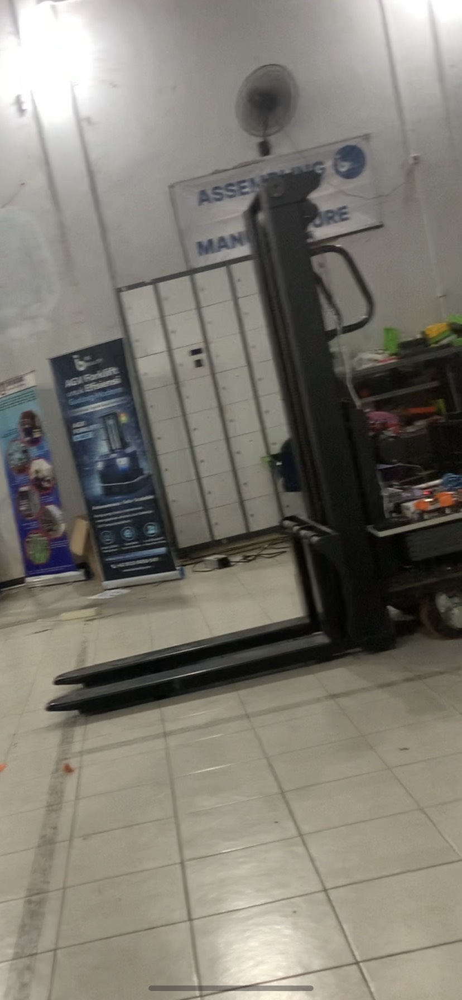<br>
      <sub>Pallet stacker forklift</sub>
    </td>
    <td align="center">
      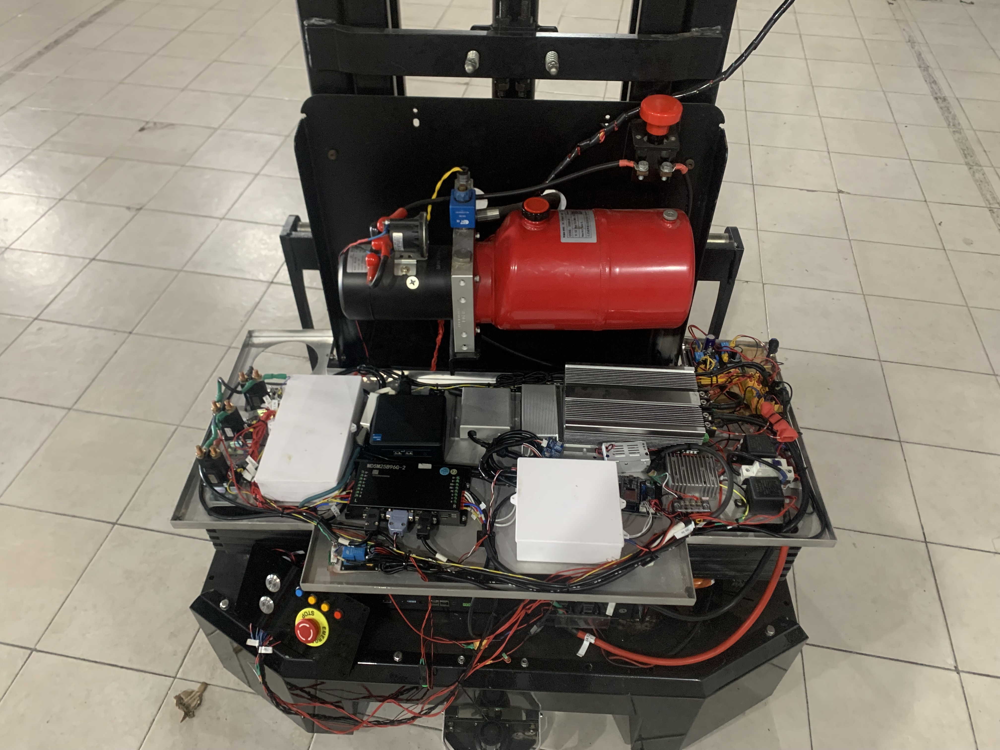<br>
      <sub>Hardware forklift: panel elektronik dan unit hidrolik</sub>
    </td>
  </tr>
</table>

---

## Logbook Minggu 1

Periode 28/09/2026 s.d. 02/10/2026, sesuai logbook individu DTEO ITS.

- Sen, 28/09 = Diskusi masalah dengan mitra di industri (2 jam); menyusun Project Charter (6 jam)
- Sel, 29/09 = Mempelajari Nav2 (4 jam); mempelajari RViz (3 jam)
- Rab, 30/09 = Membuat arsitektur sistem hardware pembaca ketinggian fork (4 jam); membuat skematik PCB (3 jam)
- Kam, 01/10 = Routing PCB (4 jam); mempersiapkan firmware pembaca ketinggian fork (3 jam)
- Jum, 02/10 = Mempelajari SLAM (4 jam); mempelajari algoritma A* dan Theta* (3 jam)
- Total = 36 jam

---

## Logbook Minggu 2

Periode 04/10/2026 s.d. 09/10/2026, sesuai logbook individu DTEO ITS.

- Min, 04/10 = Simulasi Nav2 TurtleBot3 di Gazebo (4 jam); membuat peta dengan slam_toolbox di simulasi (3 jam); latihan A* dan Theta* (2 jam)
- Sel, 06/10 = Assembly PCB encoder fork (8 jam)
- Rab, 07/10 = Testing PCB encoder fork (4 jam); integrasi PCB encoder fork dengan sistem utama (3 jam)
- Kam, 08/10 = Mempelajari CAN bus dan SocketCAN (4 jam); mempelajari node ROS 2 dan menyusun contoh node jembatan CAN (3 jam)
- Jum, 09/10 = Mempelajari driver LiDAR dan IMU, TF tree, dan URDF (4 jam); mempelajari rosbag2 dan menghitung skala encoder fork (3 jam)
- Total = 38 jam

Materi simulasi Nav2, SLAM, A*, dan Theta* hari Minggu ada di bagian [Uji Coba Simulasi Nav2](#uji-coba-simulasi-nav2), [SLAM](#slam), [Algoritma A*](#algoritma-a), dan [Algoritma Theta*](#algoritma-theta).

---

## SLAM

**SLAM (*Simultaneous Localization and Mapping*)** adalah proses membangun peta lingkungan sekaligus memperkirakan posisi robot di dalam peta tersebut. Pada proyek ini, SLAM digunakan untuk membuat peta area kerja yang nantinya dipakai Nav2 untuk navigasi.

Package yang digunakan adalah **slam_toolbox**, yaitu SLAM 2D berbasis LiDAR yang direkomendasikan oleh Nav2. Alternatifnya adalah Cartographer.

### Input dan Output

**Input**

- `/scan` (`sensor_msgs/msg/LaserScan`) = Driver LiDAR 2D
- TF `odom → base_link` = Odometri encoder + IMU (EKF)
- TF `base_link → laser` = URDF / static transform

**Output** (dari slam_toolbox)

- `/map` (`nav_msgs/msg/OccupancyGrid`) = Peta hasil SLAM
- TF `map → odom` = Koreksi posisi robot terhadap peta

### Hasil Belajar

**Apa yang dihasilkan SLAM, dan apa bedanya dengan AMCL?**

- SLAM = Membuat peta dari masukan LiDAR dan odometri, sekaligus memperkirakan posisi robot di peta yang sedang dibuat
- AMCL = Menggunakan peta yang dihasilkan SLAM dan masukan sensor untuk mengetahui posisi robot

Jadi AMCL tidak bisa bekerja tanpa peta, sedangkan SLAM yang membuat peta tersebut.

**Kenapa Localization *inactive* di mode SLAM, tapi robot tetap bisa bernavigasi?**
Di mode SLAM, `amcl` dan `map_server` tidak jalan, jadi yang menggantikan tugasnya adalah slam_toolbox. slam_toolbox menerbitkan peta (`/map`) dan TF `map → odom`, sehingga Nav2 tetap bisa bernavigasi.

**Isi file peta (`tb3_sim.yaml`)**

- `resolution` = Meter per piksel; `0.05` berarti 1 piksel = 5 cm
- `origin` = Posisi pojok kiri bawah peta dalam meter (x, y, sudut); pada peta ini `[-2.97, -2.58, 0]`
- Ukuran peta = Jumlah piksel × resolution; gambar 112 × 103 piksel × 0,05 = 5,6 × 5,15 meter

### Langkah Pembuatan Peta

1. Jalankan driver LiDAR, node bridge CAN, dan EKF (`robot_localization`).
2. Jalankan slam_toolbox dalam mode *mapping*:
   ```bash
   ros2 launch slam_toolbox online_async_launch.py use_sim_time:=false
   ```
3. Gerakkan forklift perlahan dengan remote mengelilingi seluruh area kerja.
4. Simpan peta (menghasilkan `area_kerja.pgm` dan `area_kerja.yaml`):
   ```bash
   ros2 run nav2_map_server map_saver_cli -f ~/maps/area_kerja
   ```

### Catatan

- Gerakkan forklift dengan kecepatan rendah dan kembali ke titik awal agar terjadi *loop closure*.
- Kualitas peta sangat bergantung pada akurasi odometri, sehingga kalibrasi encoder dan IMU perlu dilakukan terlebih dahulu.
- Periksa apakah pandangan LiDAR terhalang mast atau fork; jika ya, batasi sudut scan atau gunakan filter laser.

---

## Nav2

**Nav2** adalah framework navigasi pada ROS 2 untuk membawa robot dari posisi awal ke posisi tujuan secara aman. Nav2 menangani lokalisasi, perencanaan jalur, penghindaran halangan, dan *recovery* ketika robot terjebak.

### Komponen Utama

- `map_server` = Memuat peta (`.yaml` + `.pgm`)
- `amcl` = Lokalisasi robot pada peta menggunakan LiDAR (*particle filter*)
- `planner_server` = Membuat jalur global dari posisi robot ke tujuan
- `controller_server` = Mengikuti jalur dan menghasilkan perintah kecepatan `/cmd_vel`
- Costmap 2D (global & local) = Peta biaya berisi area bebas dan halangan
- `behavior_server` = Perilaku *recovery*: spin, backup, wait
- `bt_navigator` = Mengatur alur navigasi menggunakan *Behavior Tree*
- `velocity_smoother` = Menghaluskan perintah kecepatan sebelum dikirim ke motor
- `lifecycle_manager` = Mengelola start/stop seluruh node Nav2

### Hasil Belajar

**Kenapa Global Status di RViz Error sebelum initial pose diberikan?**
Karena robot tidak tahu posisi aktualnya di peta. Odometri hanya tahu perpindahan robot dari titik awalnya, bukan posisinya di peta, untuk itu `amcl` membutuhkan pose awal (initial pose). Setelah pose awal diberikan, `amcl` menerbitkan TF `map → odom` sehingga Global Status menjadi Ok.

**Apa beda tugas planner dan controller?**

- Planner = Bertugas menghitung lintasan yang aman berdasarkan peta costmap global
- Controller = Menghasilkan perintah kecepatan (`/cmd_vel`) yang akan dieksekusi oleh hardware, dengan tujuan dan jalur yang sudah ditentukan oleh planner

**Apa beda costmap global dan costmap lokal?**

- Costmap global = Mempunyai peta keseluruhan, dibangun dari peta hasil SLAM dan data sensor, digunakan oleh planner
- Costmap lokal = Bertugas membaca lingkungan sekitar robot secara aktual dari data sensor saat itu, digunakan oleh controller untuk antisipasi

**Contoh: ada orang lewat di depan robot**

- Yang pertama mendeteksi = Costmap lokal
- Yang bereaksi = Controller lebih dulu, lalu planner membuat jalur baru
- Kenapa controller lebih dulu = Karena frekuensi kerja controller lebih cepat
- Kenapa planner juga bereaksi = Karena costmap global juga membaca data sensor, jadi orang itu ikut tercatat di costmap global

### Menjalankan Nav2

```bash
ros2 launch nav2_bringup bringup_launch.py \
  map:=$HOME/maps/area_kerja.yaml \
  params_file:=<path>/nav2_params.yaml \
  use_sim_time:=false
```

---

## RViz

**RViz2** adalah tool visualisasi 3D pada ROS 2 untuk menampilkan data sensor, TF tree, peta, dan jalur navigasi robot. RViz hanya menampilkan data, bukan simulator. Tool ini dipakai untuk memantau proses SLAM dan Nav2 serta melakukan debugging.

### Display yang Digunakan

- Map (`/map`) = Menampilkan peta hasil SLAM
- LaserScan (`/scan`) = Memeriksa data LiDAR
- TF = Memeriksa pohon frame (`map`, `odom`, `base_link`, `laser`)
- RobotModel (`/robot_description`) = Menampilkan model forklift dari URDF
- Odometry (`/odom`) = Memeriksa hasil odometri
- Path (`/plan`) = Menampilkan jalur global dari Nav2
- Map costmap (`/global_costmap/costmap`, `/local_costmap/costmap`) = Menampilkan costmap Nav2

### Tool Interaktif

- **2D Pose Estimate**: memberikan posisi awal robot ke AMCL (topic `/initialpose`).
- **Nav2 Goal**: mengirim posisi tujuan navigasi ke Nav2.

### Menjalankan RViz

```bash
# RViz kosong
ros2 run rviz2 rviz2

# RViz dengan konfigurasi bawaan Nav2
ros2 launch nav2_bringup rviz_launch.py

# RViz dengan konfigurasi sendiri (File → Save Config As)
rviz2 -d config/forklift.rviz
```

---

## Uji Coba Simulasi Nav2

Sebelum diterapkan pada forklift, Nav2 diuji terlebih dahulu menggunakan simulasi robot TurtleBot3 Waffle bawaan Nav2 di Gazebo. Uji coba ini bertujuan memahami alur kerja Nav2: lokalisasi dengan AMCL, perencanaan jalur, dan pengiriman goal melalui RViz.

**Lingkungan:** Ubuntu 22.04, ROS 2 Humble, Gazebo Classic 11.

> **Catatan:** Quickstart Nav2 versi Rolling memakai paket `nav2_minimal_tb*` dan Gazebo baru (Harmonic). Pada ROS 2 Humble, simulasi memakai paket `turtlebot3_gazebo` dengan Gazebo Classic, sehingga langkahnya sedikit berbeda.

### 1. Instalasi

`$ROS_DISTRO` hanya terisi setelah ROS 2 di-*source*, jadi lakukan `source` terlebih dahulu.

```bash
source /opt/ros/humble/setup.bash      # pengguna zsh: setup.zsh

sudo apt update
sudo apt install \
    ros-$ROS_DISTRO-navigation2 \
    ros-$ROS_DISTRO-nav2-bringup \
    ros-$ROS_DISTRO-turtlebot3-gazebo
```

### 2. Menjalankan Simulasi

```bash
source /usr/share/gazebo/setup.sh
export TURTLEBOT3_MODEL=waffle
export GAZEBO_MODEL_PATH=$GAZEBO_MODEL_PATH:/opt/ros/humble/share/turtlebot3_gazebo/models

ros2 launch nav2_bringup tb3_simulation_launch.py headless:=False
```

Perintah ini membuka Gazebo (dunia simulasi) dan RViz. Pada tahap ini **Global Status di RViz masih Error**, dan terminal menampilkan pesan `Timed out waiting for transform from base_link to map`. Hal ini normal karena AMCL belum menerima posisi awal robot, sehingga transform `map → odom` belum tersedia.

> Jangan menutup jendela RViz. Pada launch ini, menutup RViz akan menghentikan seluruh proses.

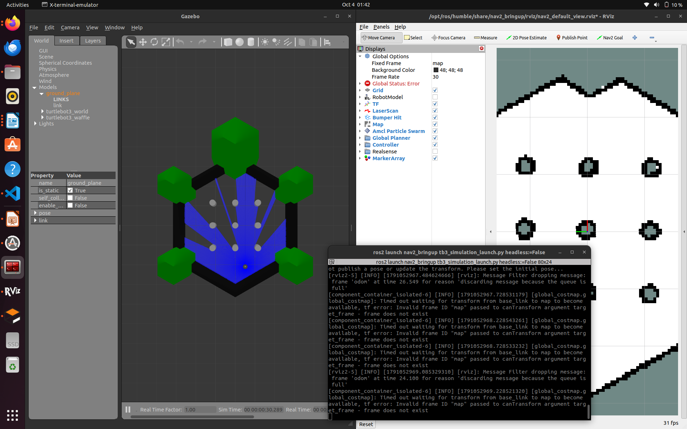
*Gazebo (kiri) menampilkan TurtleBot3 dengan sinar LiDAR berwarna biru. RViz (kanan) sudah menampilkan peta, tetapi Global Status masih Error karena initial pose belum diberikan.*

### 3. Memberikan Initial Pose

Klik **2D Pose Estimate** pada toolbar RViz, klik posisi robot pada peta, lalu tarik ke arah hadap robot. Cara lain melalui terminal:

```bash
ros2 topic pub --once /initialpose geometry_msgs/msg/PoseWithCovarianceStamped \
  "{header: {frame_id: map}, pose: {pose: {position: {x: -2.0, y: -0.5, z: 0.0}, orientation: {w: 1.0}}}}"
```

Setelah initial pose diterima, Global Status berubah menjadi **Ok**, dan panel Navigation 2 menunjukkan **Navigation: active** dan **Localization: active**.

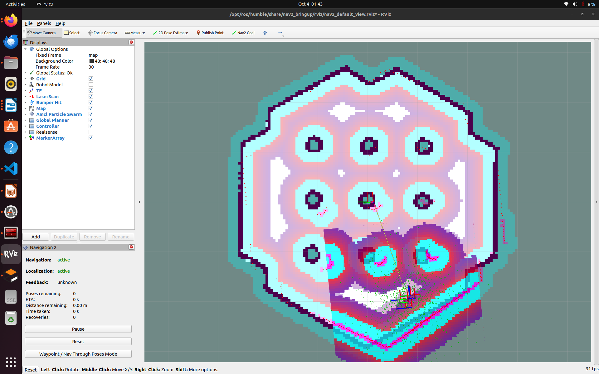
*RViz setelah initial pose diberikan. Costmap global dan lokal, data LaserScan (titik merah), dan partikel AMCL (panah hijau di sekitar robot) mulai tampil.*

### 4. Mengirim Goal Navigasi

Klik **Nav2 Goal** pada toolbar RViz, klik titik tujuan pada peta, lalu tarik untuk menentukan arah akhir robot. Cara lain melalui terminal:

```bash
ros2 action send_goal /navigate_to_pose nav2_msgs/action/NavigateToPose \
  "{pose: {header: {frame_id: map}, pose: {position: {x: 1.5, y: 0.5, z: 0.0}, orientation: {w: 1.0}}}}"
```

Jika berhasil, terminal menampilkan `Goal finished with status: SUCCEEDED`.

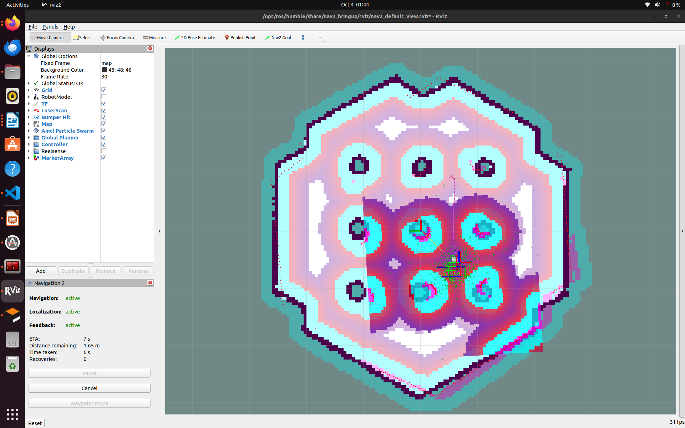
*Robot bergerak menuju goal. Panel Navigation 2 menampilkan feedback secara real-time: ETA 7 s, sisa jarak 1,65 m, waktu tempuh 6 s, dan 0 recovery.*

### Hasil Pengamatan

- Sebelum initial pose = Global Status: Error; frame `map` belum tersedia sehingga costmap global menunggu transform
- Setelah initial pose = Global Status: Ok; Navigation dan Localization *active*; costmap, LaserScan, dan partikel AMCL tampil
- Saat navigasi = Robot mengikuti jalur hasil planner sambil menghindari halangan; feedback (ETA, sisa jarak, recovery) tampil di panel Navigation 2

---

## Algoritma A*

A* adalah algoritma pencarian jalur terpendek pada grid. Berbeda dengan Dijkstra yang menjelajah ke segala arah secara merata, A* mendahulukan arah yang kelihatannya menuju goal.

### Rumus

```
f = g + h
```

- `g` = Biaya yang sudah ditempuh dari start ke kotak ini
- `h` = Perkiraan biaya dari kotak ini ke goal (heuristik)
- `f` = Perkiraan total biaya jika lewat kotak ini

Untuk grid 4 arah (atas, bawah, kiri, kanan), `h` dihitung dengan jarak Manhattan ke goal: `h = |selisih x| + |selisih y|`.

### Open List dan Closed List

- Open list = Kotak yang sudah ditemukan tapi belum dikembangkan; isinya menumpuk
- Closed list = Kotak yang sudah dikembangkan; tidak diperiksa lagi

Setiap langkah, A* mengambil kotak dengan `f` terkecil dari open list, memindahkannya ke closed list, lalu memasukkan tetangga barunya ke open list. Pencarian berhenti saat G diambil dari open list.

### Latihan 1: Menghitung g, h, dan f

```
        x=0  x=1  x=2  x=3  x=4
y=0      .    .    .    .    .
y=1      S    .    #    .    G
y=2      .    .    #    .    .
```

Tetangga S (0,1):

- (1,1) = g 1, h 3, f 4
- (0,0) = g 1, h 5, f 6
- (0,2) = g 1, h 5, f 6

A* mengembangkan (1,1) lebih dulu karena nilai `f`-nya paling kecil.

Jalur akhir: S → (1,1) → (1,0) → (2,0) → (3,0) → (3,1) atau (4,0) → G = 6 langkah.

Kalau `h` selalu bernilai 0, maka `f = g`, sehingga `g` terkecil yang didahulukan. A* tidak lagi terarah ke goal dan berubah menjadi algoritma Dijkstra.

### Latihan 2: Open List dan Closed List

```
        x=0  x=1  x=2  x=3
y=0      S    .    .    .
y=1      .    #    #    .
y=2      .    .    .    G
```

Format: kotak[g, h, f]

```
Langkah 1: ambil S
  Open   : (1,0)[1,4,5]  (0,1)[1,4,5]
  Closed : S

Langkah 2: ambil (1,0)
  Open   : (0,1)[1,4,5]  (2,0)[2,3,5]
  Closed : S, (1,0)

Langkah 3: ambil (2,0)
  Open   : (0,1)[1,4,5]  (3,0)[3,2,5]
  Closed : S, (1,0), (2,0)

Langkah 4: ambil (3,0)
  Open   : (0,1)[1,4,5]  (3,1)[4,1,5]
  Closed : S, (1,0), (2,0), (3,0)

Langkah 5: ambil (3,1)
  Open   : (0,1)[1,4,5]  G[5,0,5]
  Closed : S, (1,0), (2,0), (3,0), (3,1)

Langkah 6: ambil G → selesai
```

Jalur akhir: S → (1,0) → (2,0) → (3,0) → (3,1) → G = 5 langkah.

(0,1) tidak pernah masuk closed list. Di langkah 2, (0,1) kalah seri karena (1,0) lebih dulu masuk open list. Di langkah berikutnya, (0,1) selalu kalah karena `h`-nya lebih besar. Saat G diambil, pencarian langsung berhenti.

---

## Algoritma Theta*

Theta* adalah pengembangan A* supaya jalurnya tidak harus mengikuti arah grid (*any-angle*).

### Masalah A* di Grid

Pada grid kosong dari (0,0) ke (3,2), A* 4 arah menghasilkan jalur berbentuk tangga sepanjang 5 m. Padahal garis lurusnya hanya √(3² + 2²) ≈ 3,61 m.

### Line-of-Sight

Setiap menemukan tetangga, Theta* mengecek apakah parent dari kotak saat ini bisa melihat langsung tetangga itu, yaitu apakah garis lurus dari tengah kotak ke tengah kotak tidak melewati tembok.

- Terlihat (Path 2) = Tetangga langsung dihubungkan ke parent, kotak di tengah dilewati
- Tidak terlihat (Path 1) = Sama seperti A*, tetangga dihubungkan ke kotak saat ini

Karena jalurnya bisa miring, biaya dihitung dengan jarak lurus (Euclidean), bukan jumlah langkah.

### Latihan 3: Line-of-Sight

Grid sama dengan Latihan 1 A* (jalur A* = 6 langkah).

- S (0,1) → G (4,1) = Tidak, karena terhalang tembok di (2,1)
- S (0,1) → (2,0) = Ya, karena garis lurusnya tidak melewati tembok
- (2,0) → G (4,1) = Ya, karena garis lurusnya tidak melewati tembok; tembok (2,1) ada di bawah garis

Jalur Theta*: S → (2,0) → G

Panjang jalur: √5 + √5 = 2,24 + 2,24 = 4,48 m. Dibanding A* (6 m), Theta* lebih pendek 1,52 m.

### Kelebihan dan Kekurangan

- Kelebihan = Jalur lebih pendek dan belokannya lebih sedikit
- Kekurangan = Perlu hitungan tambahan untuk cek line-of-sight, dan belum memperhitungkan radius belok kendaraan (penting untuk forklift)

---

## Modul Sensor Ketinggian Fork

Modul ini membaca ketinggian fork menggunakan encoder dan 2 limit switch, dengan mikrokontroler STM32F401CCU6.

### Arsitektur Sistem

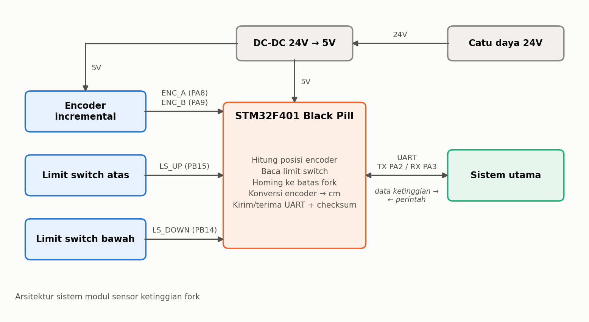

- Encoder incremental = Menghasilkan pulsa kanal A dan B saat fork bergerak, untuk menghitung posisi dan arah gerak fork
- Limit switch (2 buah) = Penanda batas atas dan batas bawah fork, juga sebagai titik acuan saat homing
- STM32F401 Black Pill = Menghitung posisi encoder, mengubahnya menjadi ketinggian (cm), dan membaca kondisi limit switch
- UART = Jalur komunikasi dua arah ke sistem utama: data ketinggian dikirim ke sistem utama, perintah dari sistem utama diterima STM32, dengan checksum
- Sistem utama = Menerima data ketinggian fork dan mengirim perintah ke modul sensor fork

### Skematik

- Catu daya = Input 24V (konektor XT30), diturunkan ke 5V dengan modul DC-DC (U2)
- Mikrokontroler = STM32F401CCU6 Black Pill (U1)
- Encoder = ENC_A (PA8) dan ENC_B (PA9) melalui konektor J5, dengan catu 5V
- Limit switch = LS_DOWN (PB14) dan LS_UP (PB15), masing-masing dengan pull-up 10k, resistor 1k, dioda 1N4148, dan kapasitor 100nF
- Komunikasi = UART TX (PA2) dan RX (PA3) melalui konektor J4
- Reset = Tombol SW1 ke pin NRST STM32; jalur RST_ALL (PA1) keluar melalui konektor J6
- Indikator = LED D1 pada jalur 3V3

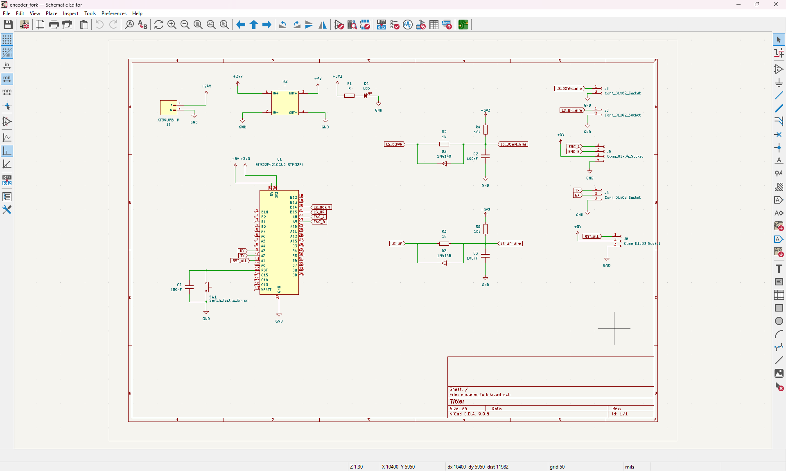

### PCB

- Software = KiCad 9.0.5
- Layer = 2 layer (F.Cu dan B.Cu)
- Status minggu 1 = Masih ada 2 koneksi yang belum di-routing
- Status minggu 2 = PCB sudah dirakit, diuji, dan dipasang di forklift (lihat [Hasil Perakitan](#hasil-perakitan-minggu-2))

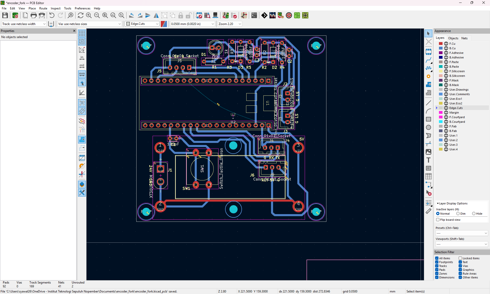

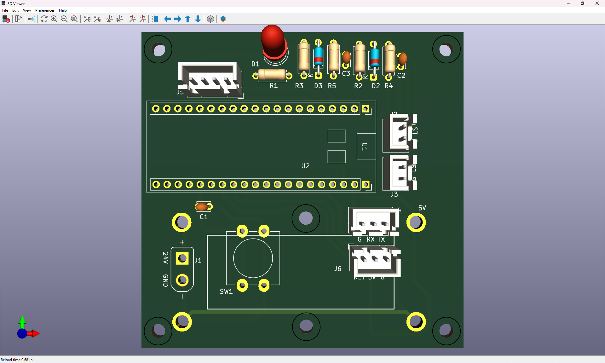

### Firmware

- IDE = STM32CubeIDE, project `encoder_forklift`
- File utama = `Core/Src/handler.c`
- Konversi = `EncoderToHeight()`: ketinggian = encoder × `HEIGHT_MAX_CM` / `ENCODER_MAX`, nilai encoder dibatasi 0 sampai `ENCODER_MAX`
- Konstanta di kode = `ENCODER_MAX` = 53808, `HEIGHT_MAX_CM` = 250 cm
- Komunikasi = UART (`huart_encoder_fork`) dengan checksum (`calc_checksum`)
- Fungsi lain = `Encoder_Update`, `encoderForkInit`, `encoderForkReceive`, `encoderForkRoutine`

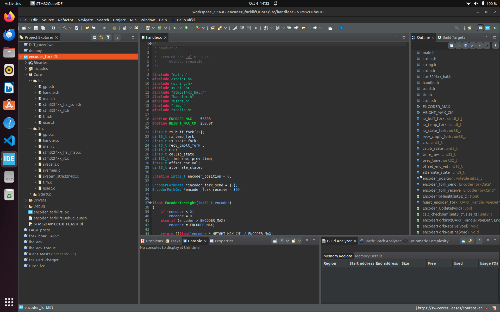

### Hasil Perakitan (Minggu 2)

PCB dirakit pada Sel, 06/10. STM32F401 Black Pill dipasang pada dua baris header female sehingga dapat dilepas untuk pemrograman atau penggantian.

<table>
  <tr>
    <td align="center">
      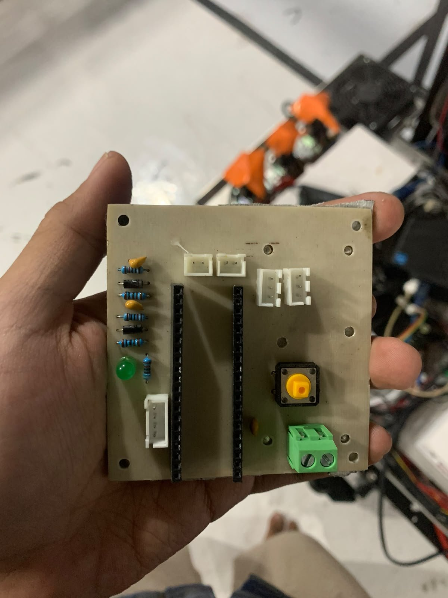<br>
      <sub>PCB tanpa Black Pill: header female, konektor JST, rangkaian limit switch, LED, tombol reset, terminal screw</sub>
    </td>
    <td align="center">
      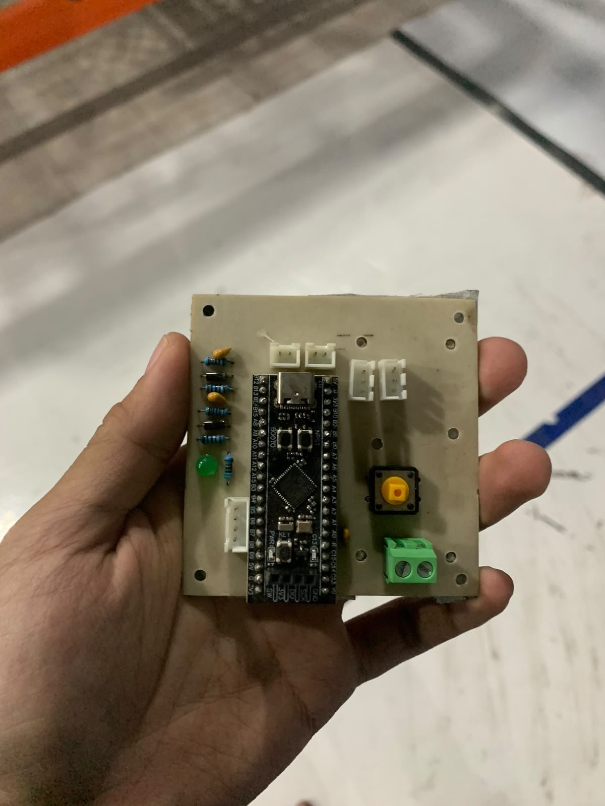<br>
      <sub>PCB dengan STM32F401 Black Pill terpasang</sub>
    </td>
  </tr>
</table>

Komponen yang terlihat pada PCB as-built:

- Header female 2 baris = Dudukan STM32F401 Black Pill
- Rangkaian limit switch = Resistor, dioda 1N4148, dan kapasitor 100nF untuk LS_DOWN dan LS_UP
- Konektor JST = Jalur encoder, limit switch, UART, dan RST_ALL
- Tombol = Reset (SW1)
- LED hijau = Indikator catu 3V3 (D1)
- Terminal screw 2 pin = Jalur catu daya

### Integrasi dengan Sistem Utama

Pada Rab, 07/10, modul diuji lalu dipasang di panel elektronik forklift, di atas driver motor dan di dekat PC onboard (mini PC Intel Core).

<p align="center">
  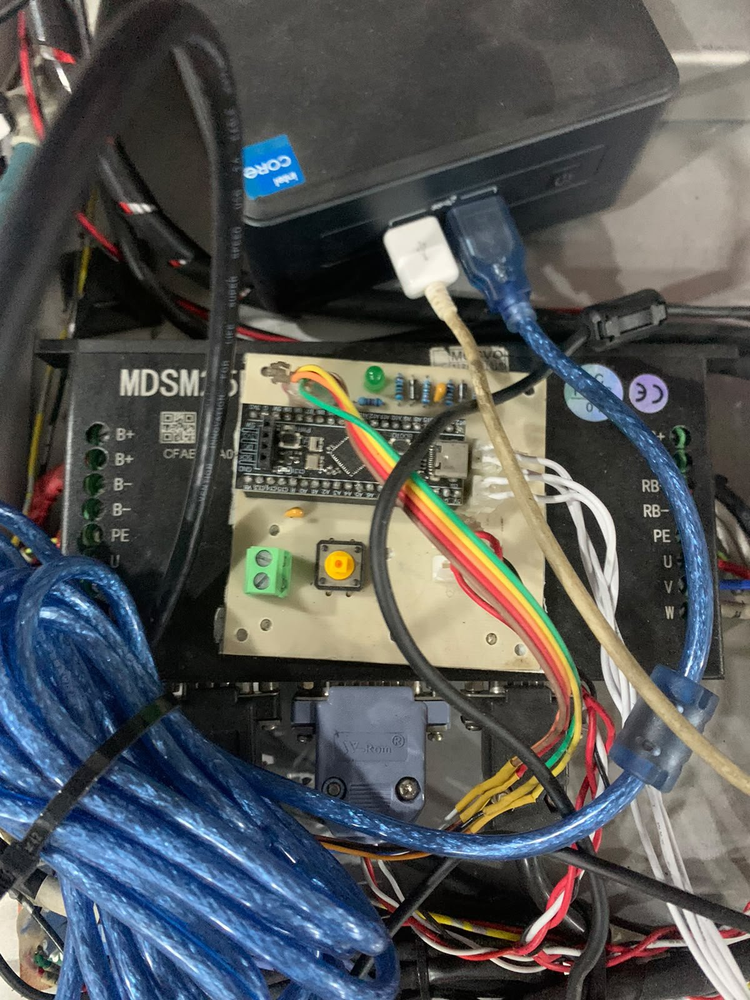<br>
  <sub>Modul sensor ketinggian fork terpasang di panel elektronik forklift</sub>
</p>

### Checklist Pengujian Modul

- [ ] Tegangan catu 5V dan 3V3 sesuai, tidak ada hubung singkat
- [ ] LED indikator menyala dan tombol reset bekerja
- [ ] Nilai encoder bertambah saat fork naik dan berkurang saat fork turun
- [ ] LS_DOWN dan LS_UP terbaca saat ditekan, tanpa *bouncing*
- [ ] Data ketinggian terkirim lewat UART dengan checksum yang benar
- [ ] Perintah dari sistem utama diterima modul


---

## CAN Bus dan SocketCAN

**CAN (*Controller Area Network*)** adalah bus komunikasi dua kabel (CAN_H dan CAN_L) yang dipakai STM32 utama forklift untuk bertukar data dengan perangkat lain. Di PC onboard (Linux), CAN diakses melalui **SocketCAN**, sehingga antarmuka CAN muncul seperti antarmuka jaringan (`can0`).

### Struktur Frame CAN

- ID = Identitas pesan, 11 bit (standard) atau 29 bit (extended); ID juga menentukan prioritas
- DLC = Jumlah byte data, 0 sampai 8 byte (CAN klasik)
- Data = Isi pesan, misalnya tinggi fork atau kecepatan motor
- CRC dan ACK = Pengecekan kesalahan dan konfirmasi penerimaan, diurus otomatis oleh hardware

### Perintah Dasar SocketCAN

```bash
# Antarmuka CAN asli (bitrate harus sama dengan STM32 utama)
sudo ip link set can0 type can bitrate 500000
sudo ip link set can0 up

# Antarmuka CAN virtual untuk latihan tanpa hardware
sudo modprobe vcan
sudo ip link add dev vcan0 type vcan
sudo ip link set vcan0 up

# Melihat dan mengirim frame (paket can-utils)
candump can0
cansend can0 101#E803
```

`101#E803` berarti frame dengan ID `0x101` dan data 2 byte `E8 03`. Jika dibaca sebagai bilangan *little-endian*, nilainya `0x03E8` = 1000.

### Hasil Belajar

**Kenapa pesan dengan ID lebih kecil menang saat dua node mengirim bersamaan?**
Bit 0 bersifat *dominant* dan menimpa bit 1 (*recessive*) di bus. Saat arbitrasi, node yang mengirim bit 1 tetapi membaca bit 0 di bus akan mundur. Jadi ID yang lebih kecil (lebih banyak bit 0 di depan) mendapat prioritas.

**Kenapa bus CAN butuh resistor 120 Ω di kedua ujung?**
Resistor terminasi menyamakan impedansi kabel sehingga sinyal tidak memantul di ujung bus. Tanpa terminasi, frame bisa rusak terutama pada bitrate tinggi.

**Apa yang perlu diketahui sebelum membuat jembatan CAN–ROS 2?**
Bitrate bus, daftar ID yang dipakai STM32 utama, serta format data tiap ID (urutan byte, satuan, dan skala). Informasi ini diambil dari firmware STM32 utama dan dicek dengan `candump`.

---

## Node ROS 2 Jembatan CAN

Node ini menjadi penghubung antara bus CAN dan ROS 2: frame dari STM32 diubah menjadi topic, dan perintah dari ROS 2 dikirim sebagai frame CAN. Contoh di bawah memakai tinggi fork sebagai kasus.

> **Catatan:** ID `0x101` dan `0x102` serta format datanya hanya contoh. Nilai sebenarnya mengikuti firmware STM32 utama forklift.

- `fork/height` (`std_msgs/msg/Float32`) = Tinggi fork dalam cm, dari frame ID `0x101` (uint16, mm)
- `fork/target` (`std_msgs/msg/Float32`) = Target tinggi fork dalam cm, dikirim sebagai frame ID `0x102` (uint16, mm)

```python
import struct

import can
import rclpy
from rclpy.node import Node
from std_msgs.msg import Float32

ID_FORK_HEIGHT = 0x101  # contoh: STM32 -> PC, tinggi fork (uint16, mm)
ID_FORK_TARGET = 0x102  # contoh: PC -> STM32, target tinggi (uint16, mm)


class CanBridge(Node):
    def __init__(self):
        super().__init__('can_bridge')
        interface = self.declare_parameter('interface', 'socketcan').value
        channel = self.declare_parameter('channel', 'can0').value
        self.bus = can.Bus(interface=interface, channel=channel)
        self.pub_height = self.create_publisher(Float32, 'fork/height', 10)
        self.create_subscription(Float32, 'fork/target', self.on_target, 10)
        self.create_timer(0.005, self.poll)  # cek bus tiap 5 ms

    def poll(self):
        msg = self.bus.recv(timeout=0.0)
        while msg is not None:
            if msg.arbitration_id == ID_FORK_HEIGHT and msg.dlc >= 2:
                height_mm = struct.unpack_from('<H', msg.data)[0]
                self.pub_height.publish(Float32(data=height_mm / 10.0))  # cm
            msg = self.bus.recv(timeout=0.0)

    def on_target(self, target):
        data = struct.pack('<H', int(target.data * 10))  # cm -> mm
        self.bus.send(can.Message(arbitration_id=ID_FORK_TARGET,
                                  data=data, is_extended_id=False))


def main():
    rclpy.init()
    node = CanBridge()
    try:
        rclpy.spin(node)
    except KeyboardInterrupt:
        pass
    finally:
        node.bus.shutdown()
        node.destroy_node()
        rclpy.shutdown()


if __name__ == '__main__':
    main()
```

### Uji dengan CAN Virtual

Simpan kode di atas sebagai `can_bridge.py`, lalu jalankan:

```bash
# Terminal 1
python3 can_bridge.py --ros-args -p channel:=vcan0

# Terminal 2: kirim tinggi 1000 mm, harus terbaca 100.0 cm
cansend vcan0 101#E803
ros2 topic echo /fork/height

# Terminal 3: kirim target 120.5 cm, harus muncul frame 102#B504
candump vcan0
ros2 topic pub --once /fork/target std_msgs/msg/Float32 "{data: 120.5}"
```

Contoh ini sudah diuji pada bus virtual python-can: frame `101#E803` menghasilkan `100.0` di `/fork/height`, dan target `120.5` menghasilkan frame `102#B504`. Contoh ini belum diuji pada bus CAN forklift.

### Hasil Belajar

**Kenapa memakai timer untuk membaca bus, bukan loop `while True`?**
`rclpy.spin()` harus tetap berjalan agar callback subscriber dan timer lain dieksekusi. Dengan timer 5 ms dan `recv(timeout=0.0)`, pembacaan bus tidak memblokir node.

**Kenapa data dikirim dalam mm (integer), bukan cm (float)?**
Frame CAN hanya 8 byte. Integer 16 bit cukup untuk 0–65535 mm dan lebih mudah diolah di STM32 dibanding float.

---

## Driver LiDAR, IMU, TF Tree, dan URDF

### Message Sensor

- `sensor_msgs/msg/LaserScan` (LiDAR 2D) = `angle_min`, `angle_max`, `angle_increment`, `range_min`, `range_max`, dan array `ranges` (meter)
- `sensor_msgs/msg/Imu` (IMU) = `orientation` (quaternion), `angular_velocity` (rad/s), `linear_acceleration` (m/s²), masing-masing dengan matriks kovarians
- `nav_msgs/msg/Odometry` (encoder motor) = Pose dan kecepatan robot terhadap frame `odom`

Satuan mengikuti REP 103: meter, radian, detik.

### Rencana TF Tree Forklift

```
map
 └── odom              ← slam_toolbox (mapping) / amcl (lokalisasi)
      └── base_link    ← robot_localization (EKF: odometri encoder + IMU)
           ├── laser       ← statis, dari URDF
           ├── imu_link    ← statis, dari URDF
           └── fork_link   ← sendi prismatic, dari tinggi fork (/joint_states)
```

### Draf URDF

```xml
<robot name="forklift">
  <link name="base_link"/>
  <link name="laser"/>
  <link name="imu_link"/>
  <link name="fork_link"/>

  <!-- Posisi xyz masih 0: diisi dari pengukuran di forklift -->
  <joint name="laser_joint" type="fixed">
    <parent link="base_link"/>
    <child link="laser"/>
    <origin xyz="0 0 0" rpy="0 0 0"/>
  </joint>

  <joint name="imu_joint" type="fixed">
    <parent link="base_link"/>
    <child link="imu_link"/>
    <origin xyz="0 0 0" rpy="0 0 0"/>
  </joint>

  <!-- Fork bergerak naik-turun: sendi prismatic sumbu z, batas dalam meter -->
  <joint name="fork_joint" type="prismatic">
    <parent link="base_link"/>
    <child link="fork_link"/>
    <origin xyz="0 0 0" rpy="0 0 0"/>
    <axis xyz="0 0 1"/>
    <limit lower="0.0" upper="2.0" effort="1000" velocity="0.1"/>
  </joint>
</robot>
```

`robot_state_publisher` membaca URDF ini dan menerbitkan TF untuk semua sendi. Untuk `fork_joint`, nilainya diambil dari topic `/joint_states`, yang dapat diisi oleh node jembatan CAN dari tinggi fork.

### Hasil Belajar

**Kenapa TF `map → odom` dan `odom → base_link` dipisah?**
Odometri bersifat halus dan kontinu, tetapi galatnya menumpuk (*drift*). Lokalisasi (AMCL atau SLAM) tidak menumpuk galat, tetapi bisa melompat. Dengan dipisah, `odom → base_link` tetap halus untuk controller, sedangkan `map → odom` menampung koreksi dari lokalisasi (REP 105).

**Siapa yang menerbitkan masing-masing TF?**

- `map → odom` = slam_toolbox atau amcl
- `odom → base_link` = EKF `robot_localization`
- `base_link → laser`, `base_link → imu_link`, `base_link → fork_link` = `robot_state_publisher` dari URDF

---

## rosbag2 dan Pengukuran Laju Topic

**rosbag2** merekam topic ROS 2 ke file sehingga data sensor dapat diputar ulang tanpa menjalankan forklift. Ini dipakai untuk metode verifikasi SP-01 (laju dan kelengkapan data sensor navigasi).

```bash
# Merekam topic sensor navigasi
ros2 bag record -o uji_sp01 /scan /odom /imu/data

# Melihat durasi, jumlah pesan, dan topic dalam rekaman
ros2 bag info uji_sp01

# Memutar ulang rekaman
ros2 bag play uji_sp01

# Mengukur laju dan bandwidth topic secara langsung
ros2 topic hz /scan
ros2 topic bw /scan
```

### Menghitung Kehilangan Data

```
pesan seharusnya  = laju nominal (Hz) × durasi (s)
kehilangan data   = (1 − pesan diterima / pesan seharusnya) × 100%
```

Contoh perhitungan: LiDAR 10 Hz direkam 60 menit (3600 s) → seharusnya 36000 pesan. Jika `ros2 bag info` menunjukkan 35500 pesan, kehilangan data = (1 − 35500/36000) × 100% = 1,39%, masih memenuhi target SP-01 (< 2%).

Target SP-01: LiDAR ≥ 10 Hz, odometri ≥ 25 Hz, IMU ≥ 10 Hz, kehilangan data < 2% pada rekaman 60 menit.

---

## Skala Encoder Fork

Kendala minggu 1 adalah konstanta skala pembacaan ketinggian fork yang belum diketahui. Bagian ini merangkum cara menghitung dan memeriksanya.

### Resolusi Encoder

```
count per putaran = PPR × 4          (timer STM32 mode encoder, kanal A dan B)
                  = 600 × 4 = 2400 count
jarak per count   = π × D / 2400     (D = diameter roda pengukur)
```

### Pemeriksaan Konstanta di Firmware

- Konstanta firmware = `ENCODER_MAX` = 53808 count untuk `HEIGHT_MAX_CM` = 250 cm
- Resolusi = 250 / 53808 = 0,00465 cm per count (≈ 0,046 mm)
- Jumlah putaran roda untuk 250 cm = 53808 / 2400 = 22,42 putaran
- Keliling roda yang tersirat = 250 / 22,42 = 11,15 cm
- Diameter roda yang tersirat = 11,15 / π ≈ 3,55 cm

Jika diameter roda pengukur sebenarnya bukan sekitar 35,5 mm, nilai `ENCODER_MAX` perlu dikoreksi.

### Rencana Kalibrasi (Minggu 6–7, SP-03)

1. Homing fork ke limit switch bawah, lalu catat count = 0.
2. Naikkan fork ke 6 titik ketinggian, ukur tinggi sebenarnya dengan meteran, catat count encoder.
3. Ulangi 2 putaran (naik dan turun).
4. Hitung regresi linear `tinggi = a × count + b`, lalu perbarui konstanta firmware.
5. Target SP-03: galat < 2 cm pada rentang 0–200 cm.

---

## Rencana Selanjutnya

Minggu 3–5 (Perancangan), sesuai Project Charter:

- Pengembangan driver CAN–ROS 2 untuk forklift, berdasarkan ID dan format pesan dari firmware STM32 utama
- Driver LiDAR 2D, IMU, dan encoder motor di ROS 2
- Perekaman rosbag data sensor navigasi
- Penyusunan Detailed Engineering Design (DED)

---

## Referensi

- [Dokumentasi Nav2](https://docs.nav2.org/)
- [Nav2 Quickstart (versi Rolling)](https://docs.nav2.org/rolling/getting_started/quickstart/quickstart/#quickstart)
- [Nav2 First-Time Robot Setup Guide](https://docs.nav2.org/setup_guides/index.html)
- [slam_toolbox](https://github.com/SteveMacenski/slam_toolbox)
- [robot_localization](https://github.com/cra-ros-pkg/robot_localization)
- [RViz2](https://github.com/ros2/rviz)
- [Dokumentasi ROS 2 Humble](https://docs.ros.org/en/humble/)
- [SocketCAN (dokumentasi kernel Linux)](https://docs.kernel.org/networking/can.html)
- [python-can](https://python-can.readthedocs.io/)
- [can-utils](https://github.com/linux-can/can-utils)
- [ROS 2 Humble: Recording and playing back data](https://docs.ros.org/en/humble/Tutorials/Beginner-CLI-Tools/Recording-And-Playing-Back-Data/Recording-And-Playing-Back-Data.html)
- [ROS 2 Humble: URDF](https://docs.ros.org/en/humble/Tutorials/Intermediate/URDF/URDF-Main.html)
- [REP 103: Standard Units of Measure and Coordinate Conventions](https://www.ros.org/reps/rep-0103.html)
- [REP 105: Coordinate Frames for Mobile Platforms](https://www.ros.org/reps/rep-0105.html)
